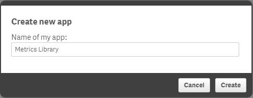
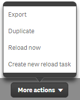
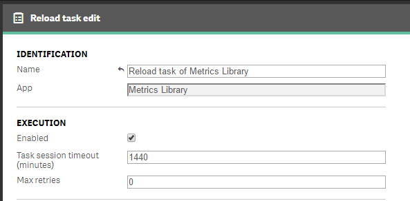
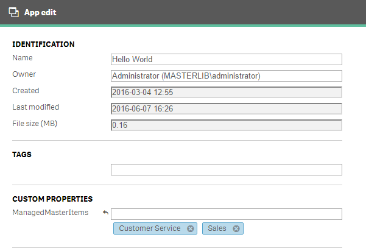

#Qlik Sense Server Configuration for Governed Metrics Service

Configuring Qlik Sense Server to use the Governed Metrics Service is a snap.  To begin distributing dimensions and measures to Qlik Sense applications, complete the tasks below.

* [Create the Metrics Library app](qsconfig.md#create-the-metrics-library-app).
* [Create a reload task for the Metrics Library app](qsconfig.md#create-a-reload-task-for-the-metrics-library-app).
* [Create the ManagedMasterItems custom property and add values](qsconfig.md#create-the-managedmasteritems-custom-property-and-add-values)
* [Apply the ManagedMasterItems custom property values to apps](qsconfig.md#apply-the-managedmasteritems-custom-property-values-to-apps).

##Create the Metrics Library App
To begin configuration, log into Qlik Sense as a user who can create applications.  From the my work stream, click Create new app and enter a name for the app that represents your metrics library.  You may want to call it "Metrics Library".  That's a good name.  Call it that.

 
###Metrics Library App Field Names
The Metrics Library app is the main application the Governed Metrics Service reads during the update process to apply dimensions and measures to applications specified using a custom property.  The app requires specific named fields to work in its default state.  Custom fields are possible, but not exposed through the REST API in the initial release.

The source data for the Metrics Library app - the central list of metrics - can be loaded from any data source.  However, when loading the data, the field names must conform to the following and contain the specified information. 

Let's define the field names for the Metrics Library App.

* __MetricSubject__ - The MetricSubject == ManagedMasterItems custom property value.  When the Governed Metrics Service reads the Metrics Library app tables, this field is used to identify which apps will receive the dimension or measure.

* __MetricType__ - This field identifies where in the Master Library a metric will be added.

* __MetricName__ - The MetricName field contains the friendly name displayed in the Master Library for the dimension or measure.

* __MetricDescription__ - This field contains a description for the dimension or measure.  When a user clicks on a Master Library item, the description will appear in the pop user interface.

* __MetricFormula__ - The MetricFormula contains the dimension field name or the expression to be used for the dimension or measure.

* __MetricOwner__ - This field identifies who owns the metric for informational purposes.

* __MetricTags__ - The MetricTags page is a semicolon delimited list of descriptive tags to be added to the dimension or measure Master Library item to aid search.

###Sample Metrics Library Table
| MetricSubject | MetricType | MetricName | MetricDescription | MetricFormula | MetricOwner | MetricTags |
| ------------- | ---------- | ---------- | ----------------- | -------------- | ----------- | ---------- |
| Customer Service | Measure | % Resolved in SLA | Percentage of Tickets handled within SLA | Sum({< [Call Ctr Days to Resolve] = {'0', '1', '2', '3', '4', '5', '6'} > } [Call Ctr Call #])/sum([Call Ctr Call #]) | Linda Lee | Key KPI;Call |
| Sales | Dimension | Country | Customer Country | Customer Country | Chad Johnson | Customer |
| Finance | Measure | Costs | Cost Amount | sum([Sales Costs]) | Gordon Wyse | Cost |

##Create a reload task for the Metrics Library app
After creating the Metrics Library app, a reload task needs to be created for it so the Governed Metrics Service can request updated metrics before applying them to apps.

To create the reload task, log into the Qlik Management Console (QMC) and go to the Apps section.  Highlight the Metrics Library App and click More actions.  Click on the Create new reload task option.

 

When the task creation screen appears, name the task the same value entered in the task name provided during the installation of the Governed Metrics Service.

##Create the ManagedMasterItems custom property and add values
In order to identify the applications that will receive metrics, the ManagedMasterItems custom property (or whatever you choose to call it during the GMS install) contains the values to be applied to apps.

Looking back on the sample metrics library table above, observe the MetricsSubject column.  This column corresponds to the values entered into the ManagedMasterItems custom property.  For the different metrics supplied from the data source, a MetricsSubject identifies the apps that will receive the dimension or measure in the master library.

To create the ManagedMasterItems custom property navigate to the Custom properties menu item in the QMC.  Click Create new and provide a name for the custom property that matches the value entered in the configuration page of the Governed Metrics Service install.

Select the App resource checkbox.
Add values to the custom property that match values in the MetricsSubject field and click apply.

##Apply the ManagedMasterItems custom property values to apps
Now that the custom property for populating metrics to applications exists, the values need to be set on applications for when the Governed Metrics Service performs an update.

To add a custom property value to an app:

1. Go back to the Apps section of the QMC and double click on an App reference in the list.  

2. When the app screen appears, activate the Custom properties section by clicking on the term located on the right side of the screen.    

3. Click on the dialog box next to ManagedMasterItems (or the custom property created for GMS) and type or select the custom property values to apply to the app.    

##Next Steps
Time to install the Governed Metrics Service in the [__next section__](../user-guide/install.md)!
